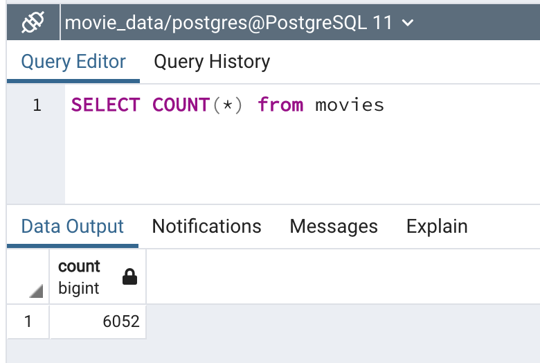
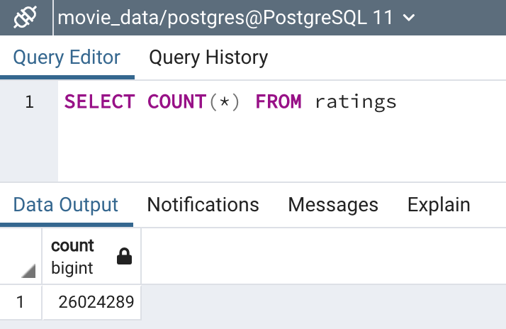

# Movies-ETL

# Purpose
The set of notebooks in this repository demonstrates the ETL process. There are 4 notebooks to go over:

* ETL_function_test.ipynb
* ETL_clean_wiki_movies.ipynb
* ETL_clean_kaggle_Data.ipynb
* ETL_create_database.ipynb

Each will be describe in their appropiate sections below.

## Deliverable 1: Write an ETL Function to Read Three Data Files
Notebook: ETL_function_test.ipynb
This notebook reads in three data files from the class folder and creates three separate data frames using the function: extract_transform_load().

## Deliverable 2: Extract and Transform the Wikipedia Data
Notebook: ETL_clean_wiki_movies.ipynb
Building on the previous notebook, the objective of this notebook is to extract and transform the Wikipedia data. The following occurs:
* TV shows are removed from the wikipedia data.
* 'imdb_id' column is extracted from the 'imdb_link' column
* non-null coumns are kept (columns where more than 90% of the data are removed)
* box office, budget data, release date, and running time data are cleaned using regex expressions and lambda functions.

## Deliverable 3: Extract and Transform the Kaggle data
Notebook: ETL_clean_kaggle_data.ipynb
Building on the previous notebooks, the objective of this notebook is to extract and transform the Kaggle data, and merge them with the wiki dataframe. The following occurs:
* merge the wiki dataframe with the kaggle dataframe.
* drop uneccessary columns from the new dataframe (movies_df) and fill in all missing data.
* filter only the necessary columns and rename the columns.
* Merge the ratings dataframe with the movies dataframe to create a new dataframe (movies_with_ratings_df).

## Deliverable 4: Create the Movie Database
Notebook: ETL_create_database.ipynb
Building on the previous notebooks, the objective of this notebook is to create the movie database tables - 'movies' and 'ratings'.
The following occurs:
* a new movie table with 6052 rows is created.

* a new ratings table with 26,024,289 rows is created.

* the elapsed time to add the data to the database is displayed.